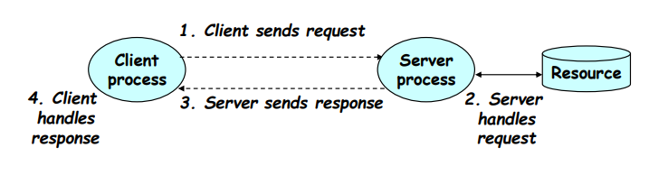
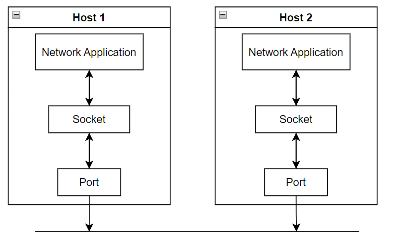
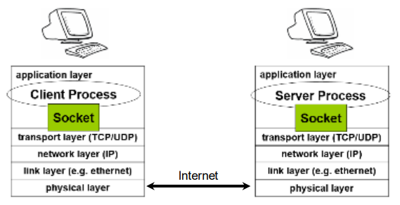
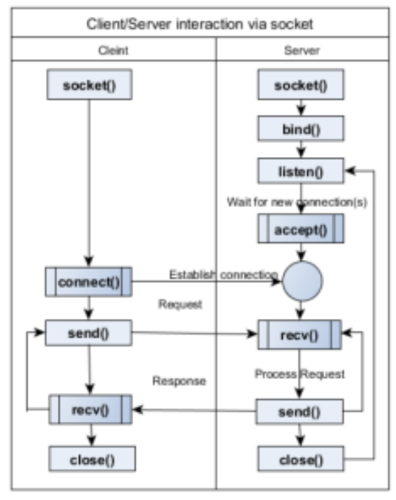
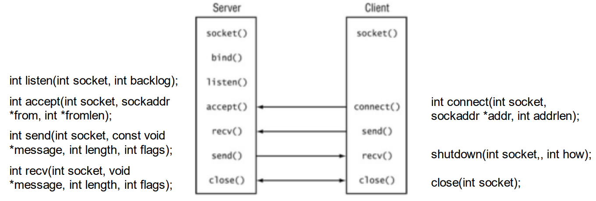

<a id="readme-top"></a>

- [Chương 1: Internet và lập trình mạng](#chương-1-internet-và-lập-trình-mạng)
  - [Phần 1: A](#phần-1-a)
  - [Phần 1](#phần-2-b)
- [Chương 2](#chương-2)
  - [Phần 1](#phần-1-c)
  - [Phần 2](#phần-2-d)
- [Chương 3](#chương-3)
  - [Phần 1](#phần-1-chương-3)
  - [Phần 2](#phần-2-chương-3)

# Chương 1: Internet và lập trình mạng
## Phần 1 A

<p align="right">(<a href="#readme-top">back to top</a>)</p>

## Phần 2: B

<p align="right">(<a href="#readme-top">back to top</a>)</p>

# Chương 2: HTTP và WWW
## Phần 1: C

<p align="right">(<a href="#readme-top">back to top</a>)</p>

## Phần 2: D

<p align="right">(<a href="#readme-top">back to top</a>)</p>

# Chương 3
## Phần 1: chương 3

<p align="right">(<a href="#readme-top">back to top</a>)</p>

## Phần 2: chương 3

<p align="right">(<a href="#readme-top">back to top</a>)</p>


# Chương 5: Socket

## Mô hình Client/Server

Client gửi yêu cầu (request) – Server cung cấp dịch vụ
(response)
- Thông thường: Single server – multiple clients 
- Server không cần biết về client 
- Client phải biết một số thông tin về server (nơi đặt server)

  

## Socket
Socket là một giao diện lập trình ứng dụng mạng 
- Qua giao diện này ta có thể lập trình điều khiển việc truyền thông giữa
hai máy sử dụng các giao thức TCP, UDP...

Một socket có thể mở/đóng một kết nối 
- Có thể gửi/nhận dữ liệu qua kết nối này 
- Dữ liệu thường gửi theo khối (packet)

Dữ liệu truyền trên internet phải sử dụng giao thức internet 
- Packet phải có địa chỉ IP nguồn/đích và cổng (port)
- Số hiệu cổng: 1 -> 65535 (nên sử dụng cổng > 1024)

Hai loại socket 
- Stream socket: dựa trên giao thức TCP (tranmission control protocol)
  - Chỉ truyền dữ liệu khi đã thiết lập kết nối 
  - Đảm bảo truyền tin cậy, đúng thứ tự 
  - Có cơ chế quản lý luồng và chống tắc nghẽn
- Datagram socket: dựa trên giao thức UDP (user datagram protocol)
  - Truyền dữ liệu không cần thiết lập kết nối
  - Truyền không tin cậy
  - Tốc độ cao

## Giao diện Socket
Khi socket được tạo – nó phải gắn (bound) với một địa chỉ
mạng và cổng  
-> Có thể truyền/nhận dữ liệu qua mạng



Socket trong ứng dụng mạng



Client/server giao tiếp qua socket
Request/response loop 
- Client gửi dữ liệu tới server 
- Server xử lý và trả về cho client 
- Kết thúc: client đóng kết nối 
- Server trở về trạng thái listen



## Socket hướng kết nối (connection-oriented)
Sử dụng giao thức TCP để thiết lập kết nối 
- Khi kết nối được thiết lập: dữ liệu có thể truyền/nhận
  

## TCP - Socket
Import thư viện socket
Gọi lớp socket  

```
from socket import *
import socket

#tạo socket TCP
s = socket.socket(family=socket.AF_INET, type=socket.SOCK_STREAM, proto=0)
print("Socket created")
```
Socket family: domain của socket: AF_INET, AF_UNIX, AF_BLUETOOTH
Socket type: TCP – SOCK_STREAM, UDP – SOCK_DGRAM
Protocol: xác định biến thể của giao thức và kiểu, thường để 0

