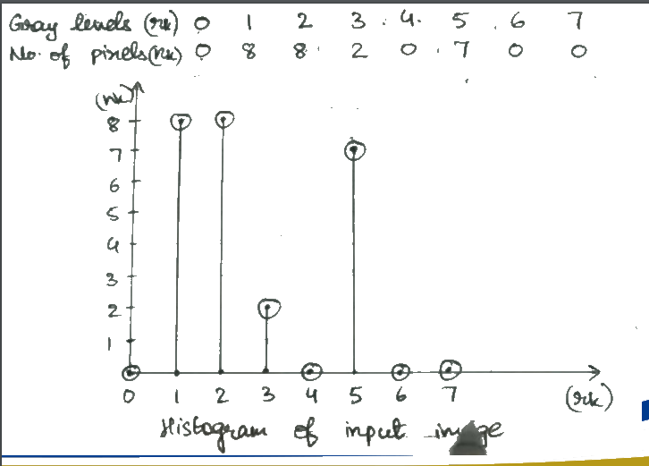
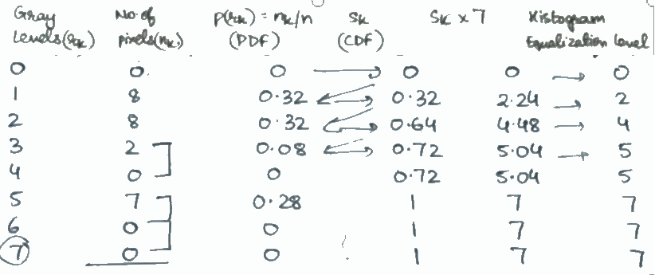
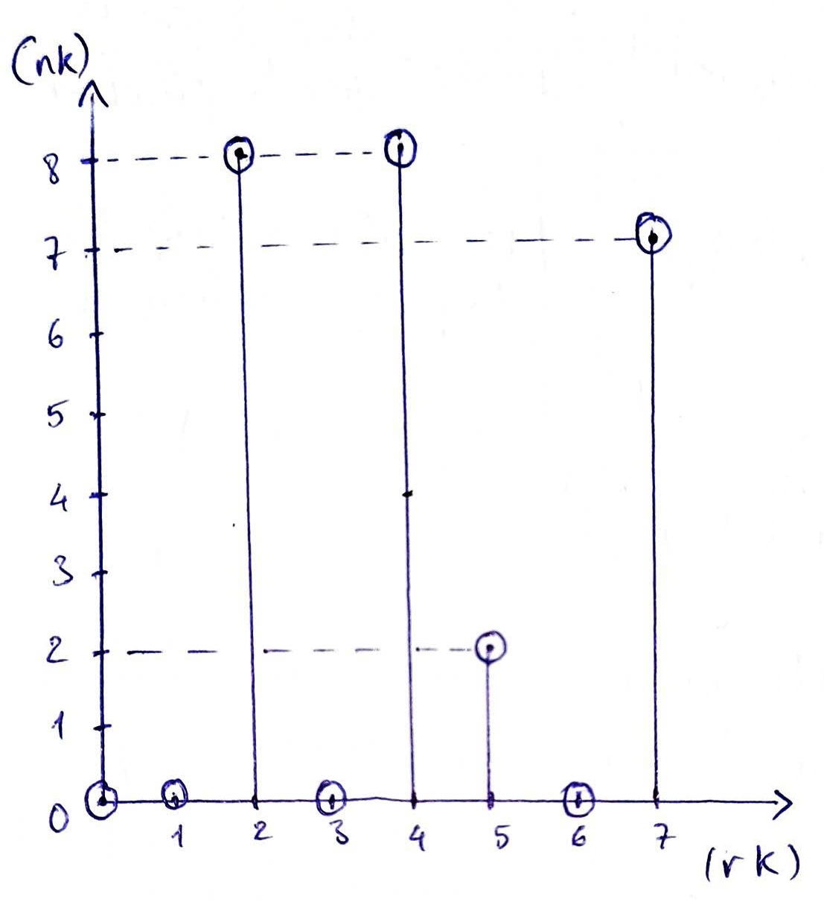

# Chương 3
## Dạng 1: cân bằng histogram
Ta có, ảnh đầu vào

| 1 | 2 | 1 | 1 | 1 |
|---|---|---|---|---|
| 2 | 5 | 3 | 5 | 2 |
| 2 | 5 | 5 | 5 | 2 |
| 2 | 5 | 3 | 5 | 2 |
| 1 | 1 | 1 | 2 | 1 |

Ảnh đầu ra sau khi cân bằng

| 2 | 4 | 2 | 2 | 2 |
|---|---|---|---|---|
| 4 | 7 | 5 | 7 | 4 |
| 4 | 7 | 7 | 7 | 4 |
| 4 | 7 | 5 | 7 | 4 |
| 2 | 2 | 2 | 4 | 2 |

Histogram của ảnh sau cân bằng

| rk | 0 | 1 | 2 | 3 | 4 | 5 | 6 | 7 |
|----|---|---|---|---|---|---|---|---|
| nk | 0 | 0 | 8 | 0 | 8 | 2 | 0 | 7 |

