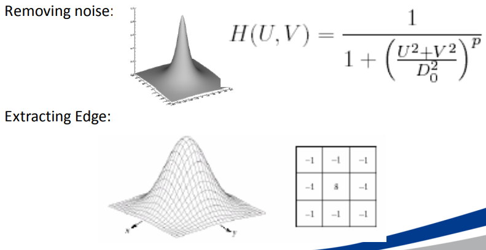
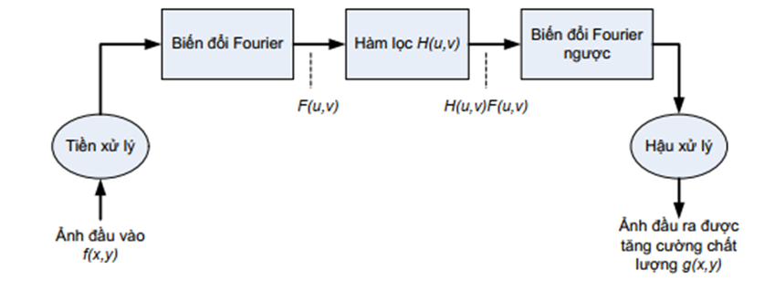
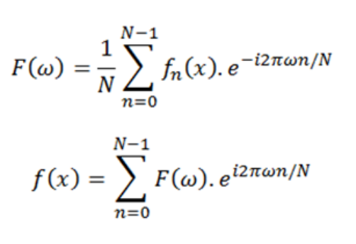

## Định nghĩa
- Biến đổi Fourier (Fourier Transform) dùng để chuyển ảnh từ miền không gian (spatial domain) sang miền tần số (frequency domain) 
- Decompose into sine and cosine components
- Ứng dụng trong: phân tích ảnh (image analysis), lọc ảnh (image filtering), tái tạo ảnh (image reconstruction), nén ảnh (image compression)

  

## Phép toán lọc miền tần số

### 1DFT 

### 2DFT

### FFT
