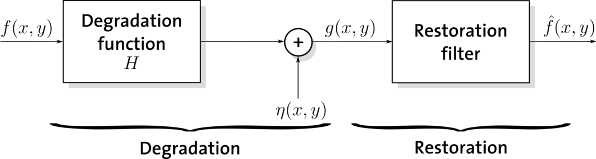
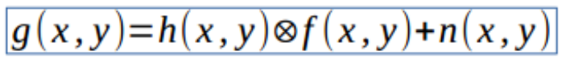
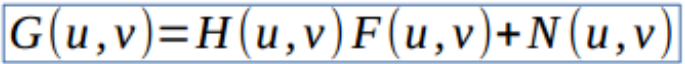
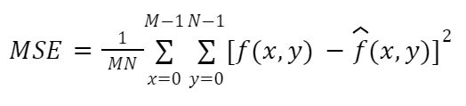
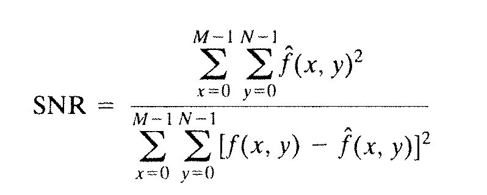

# Chapter 5 - Image Restoration
## I. Image Degradation/Restoration Model
Degradation Model (mô hình suy thoái) là quá trình thêm nhiễu vào 1 ảnh gốc **f(x, y)** ban đầu để tạo ra Image Degradation (ảnh suy thoái - có chất lượng thấp hơn ảnh ban đầu) - **g(x, y)**

Restoration Model (mô hình khôi phục) là quá trình khôi phục ảnh khi biết trước h(x, y) và \delta  

## II. Performance

- MSE: Mean-Squared Errors - Dùng để tính trung bình của **tổng bình phương sai số** giữa 2 ảnh
- f(x, y): ảnh gốc
- f^(x, y): ảnh sau khôi phục

- SNR: Signal Noise Ratio

 h&theta;(x) = &theta;o x + &theta;1x

## III. Noise Models
Một mô hình nhiễu (noise model) mô tả những đặc tính cả 1 loại nhiễu trong ảnh, mỗi loại noise model sẽ có 1 bộ lọc nhiễu (noise filter) tương ứng để xử lý

Nguyên nhân của nhiễu ảnh thường gây ra bởi quá trình thu nhận ảnh (image acquisition) hoặc quá trình truyền ảnh (image transimission)
- Ví dụ: 
  - Các yếu tố như ánh sáng, nhiệt độ có thể ảnh hưởng tới chất lượng ảnh khi chụp ảnh
  - Truyền ảnh không dây (wireless)

Một số mô hình nhiễu (Noise model)
- Salt and Pepper
- Gausian
- Speckle
- Impulse

## IV. Image Restoration 
### Mean Filters
#### 3. Harmonic Mean Filter
It works well for salt noise, Gaussian noise. But fails for pepper noise

#### 4. Contra-Harmonic Mean Filter
Used for:
- Salt and pepper noise. 
  - Q > 0: eliminate pepper noise
  - Q < 0: eliminate salt noise

### Order Statistic Filters

## V. Restoration for Noise-Only Degradation - Spatial Filtering, Mean Filters, Order-Statistic Filters
## VI. Restoration for Blur-Only Degradation-Wiener Filtering