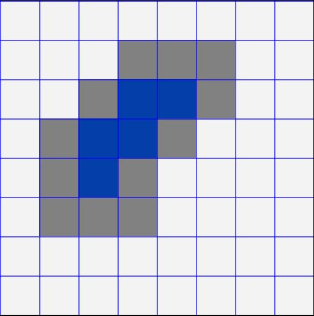

## Morphological
- Morphological operations (Các phép toán hình thái) là 1 tập hợp các kỹ thuật được dùng trong **Xử lý ảnh** để phân tích và chỉnh sửa hình dag và cấu trúc của các đối tượng trong 1 ảnh

Một số phép toán hình thái
- Erosion (Xói mòn): Thu hẹp ranh giới của các đối tượng trong một hình ảnh. 
- Dilation (Giãn nở): Mở rộng ranh giới của các đối tượng trong một hình ảnh. 
- Opening (Mở): Xóa các đối tượng nhỏ và nhiễu khỏi một hình ảnh. 
- Closing (Đóng): Lấp đầy các lỗ hổng bên trong các đối tượng và xóa các khoảng trống nhỏ giữa các đối tượng. 
- Hit-or-miss: Phát hiện các mẫu hoặc hình dạng cụ thể trong một hình ảnh. 
- Skeletonization: Giảm một đối tượng thành bộ xương hoặc trục giữa của nó.

## Set Theory

## Logic operators 

## Reflection of Structural Element
Phần tử cấu trúc (Structural Element - SE):
- Là 1 ma trận được sử dụng trong các phép toán hình thái
- Ví dụ

  | 0 | 1 | 0 |
  |---|---|---|
  | 1 | 1 | 1 |
  | 0 | 1 | 0 |

Phép phản chiếu (reflection) là phép quay 180 độ của **phần tử cấu trúc** xung quanh điểm trung tâm 

### Hit, Fit, Miss
- Fit: occurs when **all** the pixels of the SE match the pixels of the image
- Hit: occurs when **any** pixel of the SE match a pixel of the image
- Miss: occurs when **no** pixel of the SE match any pixel of the image
- Ví dụ  
Với 2 Structural Element như sau
<table>
  <tr>
    <td>   
SE 1

    </td>
    <td>  
SE 2
</td>
  </tr>
</table>

<table>
  <td>   
Ma trận mẫu

  </td>
</table>

SE_1 áp dụng lên:
- Khu vực A: Hit  
- Khu vực B: Fit  
- Khu vực C: Miss  

SE_2 áp dụng lên:
- Khu vực A: Fit (chỉ cần tất cả số '1' của SE nằm trùng với các số '1' của sub_box, các số '0' của SE thì không cần quan tâm)
- Khu vực B: Fit
- Khu vực C: Miss

## Một số phép toán hình thái
### Erosion
<table>
  <td>   
SE sử dụng

  </td>
</table>

Ma trận ban đầu:  

| 0 | 0 | 0 | 0 | 0 | 0 | 0 | 0 |
|---|---|---|---|---|---|---|---|
| 0 | 0 | 0 | 1 | 1 | 1 | 0 | 0 |
| 0 | 0 | 1 | 1 | 1 | 1 | 0 | 0 |
| 0 | 1 | 1 | 1 | 1 | 0 | 0 | 0 |
| 0 | 1 | 1 | 1 | 0 | 0 | 0 | 0 |
| 0 | 1 | 1 | 1 | 0 | 0 | 0 | 0 |
| 0 | 0 | 0 | 0 | 0 | 0 | 0 | 0 |
| 0 | 0 | 0 | 0 | 0 | 0 | 0 | 0 |

Ma trận sau khi xử lý:

| 0 | 0 | 0 | 0 | 0 | 0 | 0 | 0 |
|---|---|---|---|---|---|---|---|
| 0 | 0 | 0 | 0 | 0 | 0 | 0 | 0 |
| 0 | 0 | 0 | 1 | 1 | 0 | 0 | 0 |
| 0 | 0 | 1 | 1 | 0 | 0 | 0 | 0 |
| 0 | 0 | 1 | 0 | 0 | 0 | 0 | 0 |
| 0 | 0 | 0 | 0 | 0 | 0 | 0 | 0 |
| 0 | 0 | 0 | 0 | 0 | 0 | 0 | 0 |
| 0 | 0 | 0 | 0 | 0 | 0 | 0 | 0 |

<table>
  <tr>
    <td>   
Input

    </td>
    <td>  
Output
</td>
  </tr>
</table>

### Dilation
