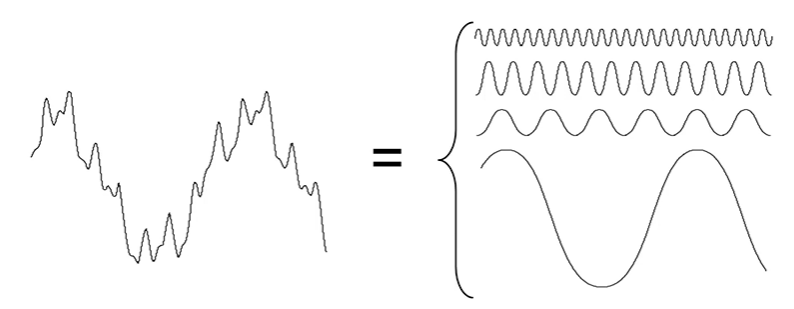

## Smoothing Linear Filter
### Gaussian Filter

Gaussian filtering thường dùng để khử nhiễu (**noise reduction**). By applying a Gaussian kernel, the filter gives central pixels more weight than surrounding regions, effectively reducing noise while preserving image structure. The essential parameter σ controls the filter’s scope and subsequent smoothing. Gaussian filters are excellent at removing random, subtle image noise patterns, making them vital in many image processing applications.

## Frequency Domain Filter
### Biến đổi Fourier
Một hàm bất kì lặp lại có tính chu kỳ, có thể biểu diễn dưới dạng tổng các hàm sine và cosine ở các tần số khác nhau - là chuỗi Fourier

- Ví dụ:

Việc phân tích 1 hàm bất kỳ thành tập hợp của những hàm sine và cosine gọi là **Biến đổi Fourier**. Mục đích của biến đổi Fourier là để cải thiện ảnh

### Biến đổi Fourier rời rạc - Discrete Fourier Transform (DFT)  
