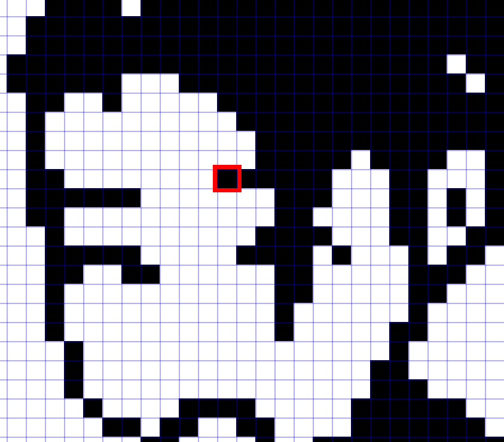

- [Chương 1](#chương-1-overview-of-image-processing)
  - [Phần 1](#phần-1-thế-nào-là-image-và-digital-image)
  - [Phần 2](#phần-2-digital-image-processing-là-gì)
- [Chương 2](#chương-2)
  - [Phần 1](#phần-1-c)
  - [Phần 2](#phần-2-d)
- [Chương 3](#chương-3)
  - [Phần 1](#phần-1-chương-3)
  - [Phần 2](#phần-2-chương-3)

# Chương 1: Overview of Image Processing
## Phần 1: Thế nào là image và digital image
Ảnh kỹ thuật số (**digital image**) có thể được biểu diễn dưới dạng 1 ma trận 2 chiều f(x, y). Trong đó, x, y là tọa độ của mỗi điểm ảnh (pixel), và f là cường độ (**intensity**) hoặc mức xám (**gray level**) tại điểm ảnh đó

Điểm ảnh (**pixel**) là 1 phần tử của ảnh kỹ thuật số với tọa độ và mức xám nhất định

(<a href="#readme-top">back to top</a>)

Mức xám là thang đo độ sáng của 1 điểm ảnh trong đoạn [0, 255]

## Phần 2: Digital image processing là gì?

(<a href="#readme-top">back to top</a>)

# Chương 2
## Phần 1: C

(<a href="#readme-top">back to top</a>)

## Phần 2: D

(<a href="#readme-top">back to top</a>)

# Chương 3
## Phần 1: chương 3

(<a href="#readme-top">back to top</a>)

## Phần 2: chương 3

(<a href="#readme-top">back to top</a>)
