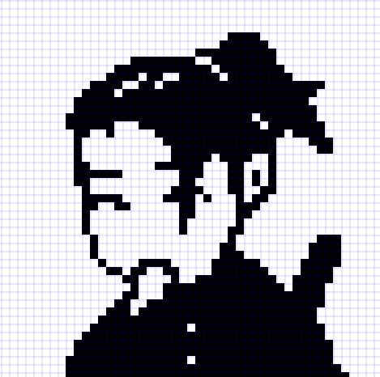

- [Chương 1: Tổng quan về xử lý ảnh](#chương-1-tổng-quan-về-xử-lý-ảnh-image-processing)
  - [Phần 1: Các thành phần của digital image](#phần-1-các-thành-phần-của-digital-image)
  - [Phần 2: Một số mô hình màu](#phần-2-một-số-mô-hình-màu)
  - [Phần 3: Phần 3: Xử lý ảnh là gì? Ứng dụng của xử lý ảnh](#phần-3-xử-lý-ảnh-là-gì-ứng-dụng-của-xử-lý-ảnh)
  - [Phần 4: Các giai đoạn của quá trình xử lý ảnh](#phần-4-các-giai-đoạn-của-quá-trình-xử-lý-ảnh)
- [Chương 2](#chương-2)
  - [Phần 1](#phần-1-c)
  - [Phần 2](#phần-2-d)
- [Chương 3](#chương-3)
  - [Phần 1](#phần-1-chương-3)
  - [Phần 2](#phần-2-chương-3)

# Chương 1: Tổng quan về xử lý ảnh (Image Processing)
## Phần 1: Các thành phần của digital image
Ảnh kỹ thuật số (**digital image**) có thể được biểu diễn dưới dạng 1 ma trận 2 chiều f(x, y). Trong đó, x, y là tọa độ của mỗi điểm ảnh (pixel), và f là cường độ (**intensity**) hoặc mức xám (**gray level**) tại điểm ảnh đó  

Điểm ảnh (**pixel**) là 1 phần tử của ảnh kỹ thuật số với tọa độ và mức xám nhất định  

(<a href="#readme-top">back to top</a>)

Mức xám (**gray scale**) là thang đo độ sáng của 1 điểm ảnh trong đoạn **[0, 255]**
<table>
    <tr>
        <th>Ảnh</th>
        <th>Ma trận của ảnh</th>
    </tr>
    <tr>
        <td></td>
        <td></td>
    </tr>
</table>

Độ sâu màu (**color depth**), còn gọi là **bit depth**, chỉ số lượng bit được dùng để thể hiện màu của 1 pixel trên ảnh  

Độ phân giải của ảnh (**image resolution**), là số lượng pixel được sử dụng để thể hiện ảnh  

Phân loại digital image
- Binary image: ảnh nhị phân, chỉ có 2 màu đen-trắng

- Gray image: ảnh xám, được xây dựng từ 1 ma trận màu

- Color image: ảnh màu, được xây dựng từ nhiều ma trận màu

## Phần 2: Một số mô hình màu
### Mô hình màu cộng (Additive color model)
#### RGB - Red-Green-Blue

#### HSV - Hue-Saturation-Value

### Mô hình màu trừ (Subtractive color model)
#### CMYK-Cyan-Magenta-Yellow-Black

(<a href="#readme-top">back to top</a>)

## Phần 3: Xử lý ảnh là gì? Ứng dụng của xử lý ảnh
Xử lý ảnh (**image processing**) là 1 lĩnh vực Khoa học máy tính (**computer science**). liên quan đến việc thao tác với ảnh kỹ thuật số (**digital image**) để trích xuất thông tin hoặc nâng cao chất lượng của chúng

Một số ứng dụng của **Xử lý ảnh**:  
- Y tế:
  - Phân tích X-quang: Phát hiện các bất thường như khối u hoặc gãy xương.
  - Chụp CT: Tạo mô hình 3D của các cơ quan nội tạng để chẩn đoán và lập kế hoạch phẫu thuật.
  - Chụp MRI: Hình ảnh hóa các mô mềm và phát hiện các bệnh như ung thư.

- Xe tự lái:
  - Phát hiện vật thể: Nhận dạng người đi bộ, phương tiện và biển báo giao thông.
  - Phát hiện làn đường: Phát hiện vạch kẻ làn đường để lái xe tự động.
  - Phát hiện chướng ngại vật: Tránh va chạm với chướng ngại vật.

- An ninh và giám sát:
  - Nhận dạng khuôn mặt: Nhận dạng cá nhân cho mục đích an ninh. 
  - Theo dõi vật thể: Theo dõi chuyển động của các vật thể trong một cảnh. 
  - Nhận dạng biển số xe: Tự động nhận dạng biển số xe.

(<a href="#readme-top">back to top</a>)

## Phần 4: Các giai đoạn của quá trình xử lý ảnh

(<a href="#readme-top">back to top</a>)

# Chương 2
## Phần 1: C

(<a href="#readme-top">back to top</a>)

## Phần 2: D

(<a href="#readme-top">back to top</a>)

# Chương 3
## Phần 1: chương 3

(<a href="#readme-top">back to top</a>)

## Phần 2: chương 3

(<a href="#readme-top">back to top</a>)
