

- [Chương 1: Tổng quan về xử lý ảnh](#chương-1-tổng-quan-về-xử-lý-ảnh-image-processing)
  - [Phần 1: Các thành phần của digital image](#phần-1-các-thành-phần-của-digital-image)
  - [Phần 2: Một số mô hình màu](#phần-2-một-số-mô-hình-màu)
  - [Phần 3: Phần 3: Xử lý ảnh là gì? Ứng dụng của xử lý ảnh](#phần-3-xử-lý-ảnh-là-gì-ứng-dụng-của-xử-lý-ảnh)
  - [Phần 4: Các giai đoạn của quá trình xử lý ảnh](#phần-4-các-giai-đoạn-của-quá-trình-xử-lý-ảnh)
- [Chương 2: Thu nhận ảnh và biểu diễn ảnh](#chương-2-thu-nhận-và-biểu-diễn-ảnh)
  - [Phần 1: Thu nhận ảnh](#phần-1-thu-nhận-ảnh-image-acquisition)
  - [Phần 2: Biểu diễn ảnh](#phần-2-biểu-diễn-ảnh-digital-image-representation)
- [Chương 3: Cải thiện hình ảnh](#chương-3-cải-thiện-hình-ảnh)
  - [Phần 1: Cải thiện hình ảnh là gì?](#phần-1-cải-thiện-hình-ảnh-là-gì)
  - [Phần 2: Miền không gian](#phần-2-miền-không-gian)
  - [Phần 3: Miền tần số](#phần-3-miền-tần-số)
  - [Phần 4: Combination](#phần-4-combination)

# Chương 1: Tổng quan về xử lý ảnh (Image Processing)
## Phần 1: Các thành phần của digital image
Ảnh kỹ thuật số (**digital image**) có thể được biểu diễn dưới dạng 1 ma trận 2 chiều f(x, y). Trong đó, x, y là tọa độ của mỗi điểm ảnh (pixel), và f là cường độ (**intensity**) hoặc mức xám (**gray level**) tại điểm ảnh đó  

Điểm ảnh (**pixel**) là 1 phần tử của ảnh kỹ thuật số với tọa độ và mức xám nhất định  
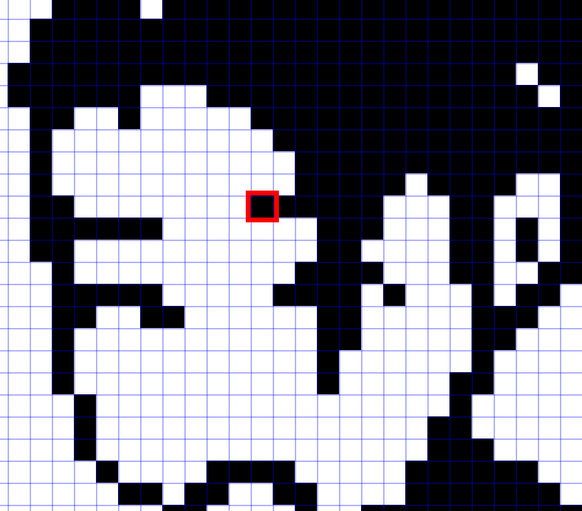

(<a href="#readme-top">back to top</a>)

Mức xám (**gray scale**) là thang đo độ sáng của 1 điểm ảnh trong đoạn **[0, 255]**
<table>
    <tr>
        <th>Ảnh</th>
        <th>Ma trận của ảnh</th>
    </tr>
    <tr>
        <td>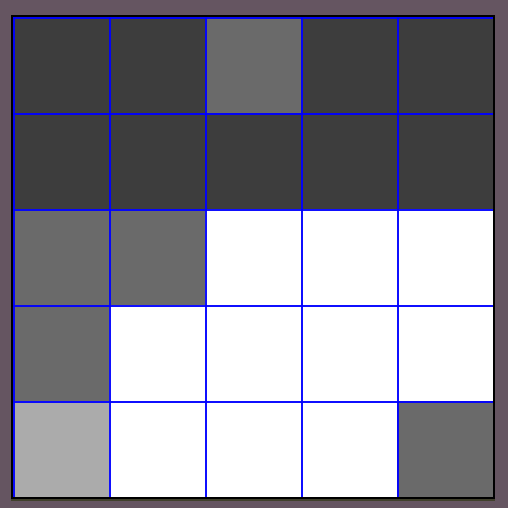</td>
        <td></td>
    </tr>
</table>

Độ sâu màu (**color depth**), còn gọi là **bit depth**, chỉ số lượng bit được dùng để thể hiện màu của 1 pixel trên ảnh  

Độ phân giải của ảnh (**image resolution**), là số lượng pixel được sử dụng để thể hiện ảnh  

Phân loại digital image
- Binary image: ảnh nhị phân, chỉ có 2 màu đen-trắng  

- Gray image: ảnh xám, được xây dựng từ 1 ma trận màu  

- Color image: ảnh màu, được xây dựng từ nhiều ma trận màu  
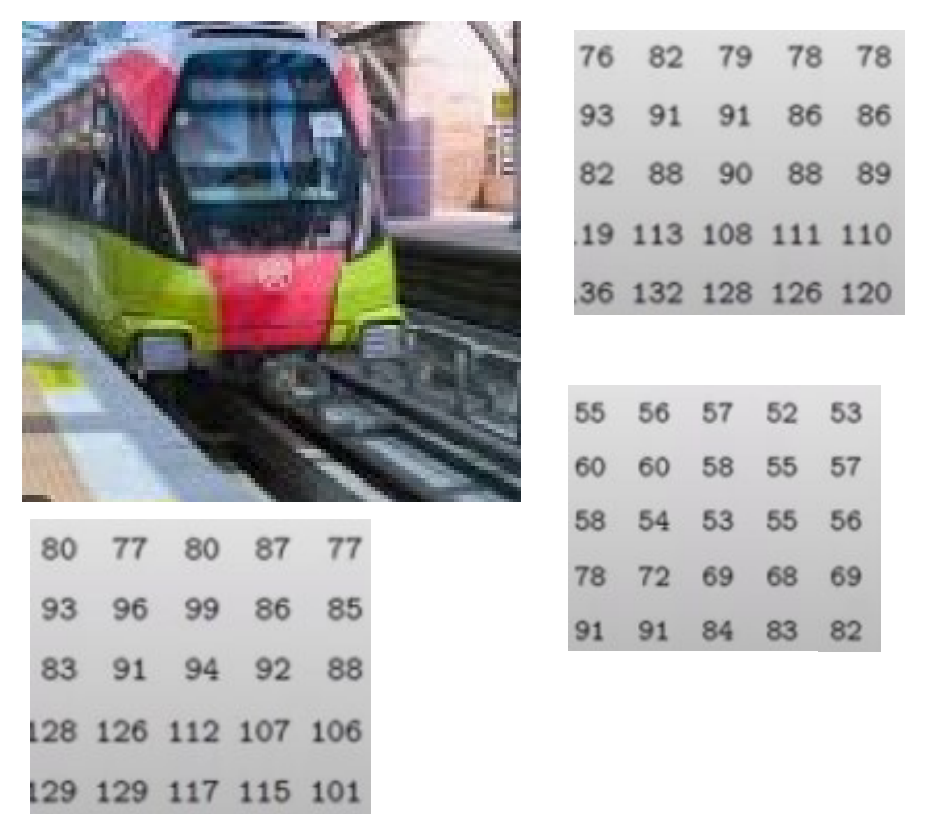

## Phần 2: Một số mô hình màu
### Mô hình màu cộng (Additive color model)
#### RGB - Red-Green-Blue

#### HSV - Hue-Saturation-Value

### Mô hình màu trừ (Subtractive color model)
#### CMYK-Cyan-Magenta-Yellow-Black

(<a href="#readme-top">back to top</a>)

## Phần 3: Xử lý ảnh là gì? Ứng dụng của xử lý ảnh
Xử lý ảnh (**image processing**) là 1 lĩnh vực Khoa học máy tính (**computer science**). liên quan đến việc thao tác với ảnh kỹ thuật số (**digital image**) để trích xuất thông tin hoặc nâng cao chất lượng của chúng

Một số ứng dụng của **Xử lý ảnh**:  
- Y tế:
  - Phân tích X-quang: Phát hiện các bất thường như khối u hoặc gãy xương.
  - Chụp CT: Tạo mô hình 3D của các cơ quan nội tạng để chẩn đoán và lập kế hoạch phẫu thuật.
  - Chụp MRI: Hình ảnh hóa các mô mềm và phát hiện các bệnh như ung thư.

- Xe tự lái:
  - Phát hiện vật thể: Nhận dạng người đi bộ, phương tiện và biển báo giao thông.
  - Phát hiện làn đường: Phát hiện vạch kẻ làn đường để lái xe tự động.
  - Phát hiện chướng ngại vật: Tránh va chạm với chướng ngại vật.

- An ninh và giám sát:
  - Nhận dạng khuôn mặt: Nhận dạng cá nhân cho mục đích an ninh. 
  - Theo dõi vật thể: Theo dõi chuyển động của các vật thể trong một cảnh. 
  - Nhận dạng biển số xe: Tự động nhận dạng biển số xe.

(<a href="#readme-top">back to top</a>)

## Phần 4: Các giai đoạn của quá trình xử lý ảnh
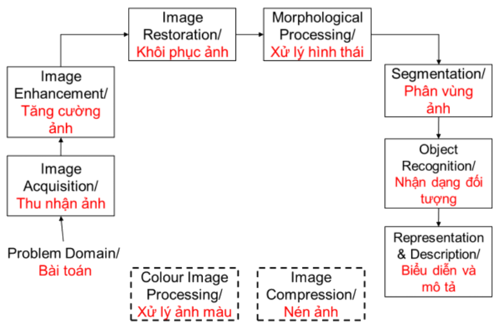

(<a href="#readme-top">back to top</a>)

# Chương 2: Thu nhận ảnh và biểu diễn ảnh
## Phần 1: Thu nhận ảnh (Image Acquisition)

(<a href="#readme-top">back to top</a>)

## Phần 2: Biểu diễn ảnh (Digital image representation)

(<a href="#readme-top">back to top</a>)

# Chương 3: Cải thiện hình ảnh
## Phần 1: Cải thiện hình ảnh là gì?
Cải thiện hình ảnh (**image enhancement**) là quá trình xử lý kỹ thuật số để cải thiện chất lượng của hình ảnh thông quá các khía cạnh của ảnh như: độ tương phản (**contrast**), độ sáng (**brightness**), độ sắc nét (**sharpness**), giảm nhiễu (**noise reduction**)

(<a href="#readme-top">back to top</a>)

## Phần 2: Miền không gian
(**spatial domain**)
Hầu hết các phép toán cải thiện ở miền không gian (**spatial domain enhancement operations**) có thể được rút gọn thành dạng: 

$$
**g (x, y) = T[ f (x, y)]**
$$
- $f(x, y)$: ảnh đầu vào
- $g(x, y)$: ảnh đã xử lý
- $T$: toán tử được áp dụng vào vùng lân cận của (x, y)

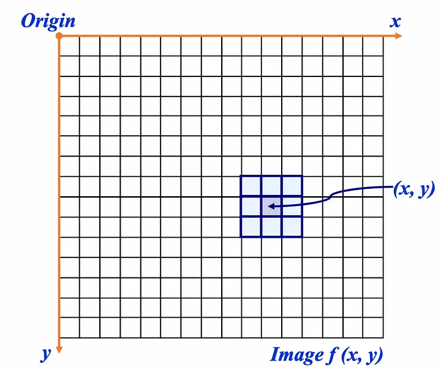

### Kỹ thuật xử lý điểm
Khi vùng lân cận đạt mức nhỏ nhất (size = 1*1) - bằng đúng 1 điểm ảnh, các phép toán cải thiện ảnh sẽ được biểu diễn thành: 

$$
s = T(r)
$$
- $r$: điểm ảnh trước khi xử lý
- $s$: điểm ảnh sau khi được xử lý

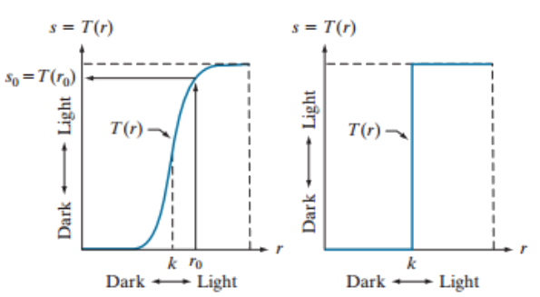

<table>
    <tr>
        <td>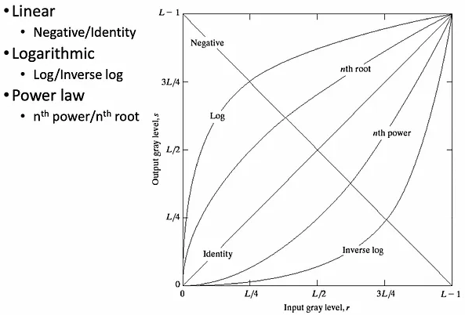</td>
    </tr>
    <tr>
      <th>Một số biến đổi mức xám</th>
    </tr>
</table>

#### Ảnh âm bản (**negative image**)
<table>
    <tr>
        <td>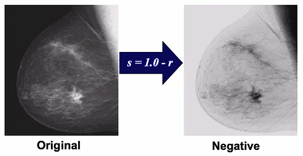</td>
    </tr>
    <tr>
        <th>mammogram and negative image of mammogram</th>
    </tr>
</table>

Ảnh âm bản dùng để làm nổi bật các chi tiết  
$s = intensity_{max} — r$

#### Biến đổi Logarit (Logarithm transformation)
Công thức chung của biến đổi logarit: $s = c * log(1 + r)$. Giá trị $c$ thường được đặt là 1

Kỹ thuật dùng để tăng cường độ sáng các vùng tối của ảnh 

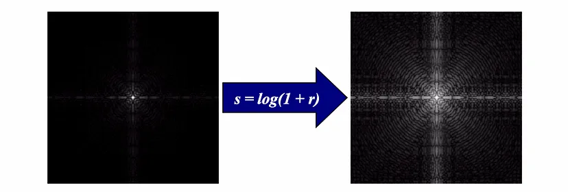

#### Biến đổi luật lũy thừa (Power Law - Gamma Correction Transformations)
Công thức chung: $s = c*r^{\gamma}$. Giá trị $c$ thường là 1

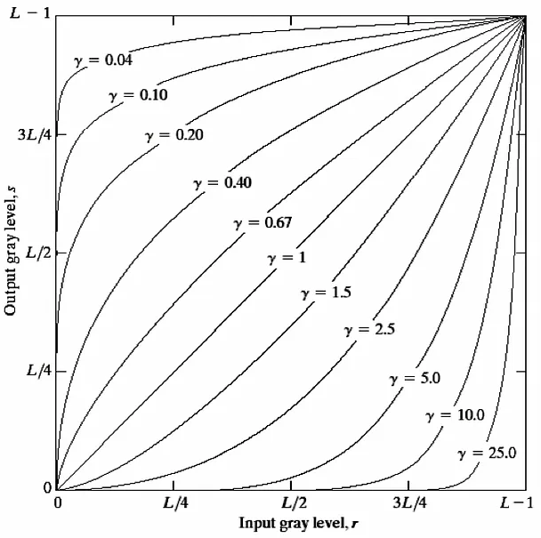

<table>
    <tr>
        <td>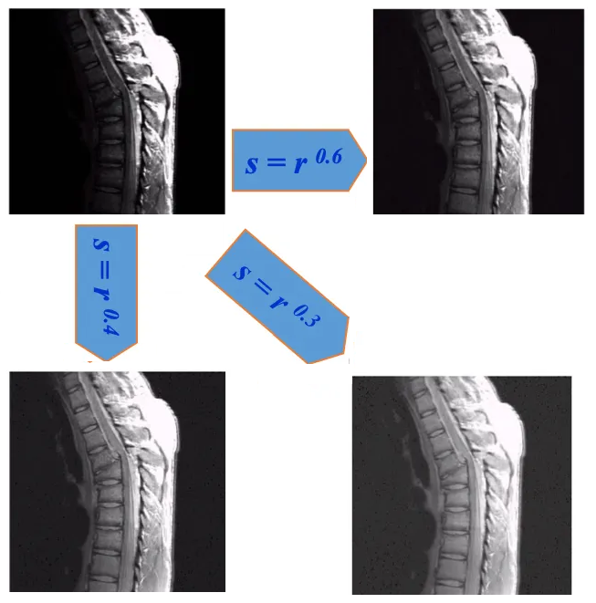</td>
        <td>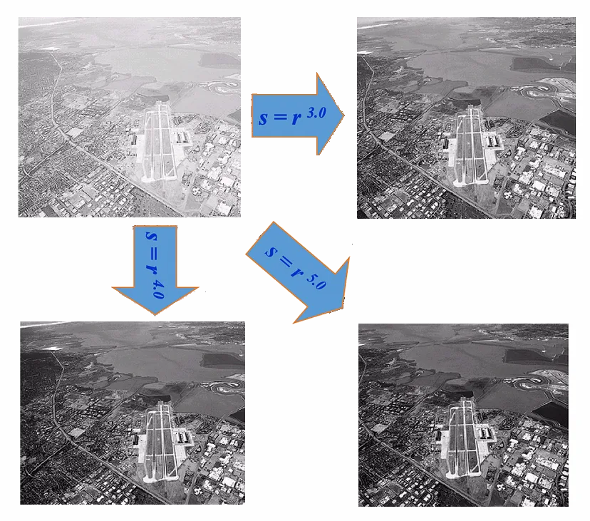</td>
    </tr>
    <tr>
        <th>Highlight</th>
        <th>Làm tối ảnh</th>
    </tr>
</table>

#### Biến đổi ngưỡng (Threasholding)

<table>
    <tr>
        <td>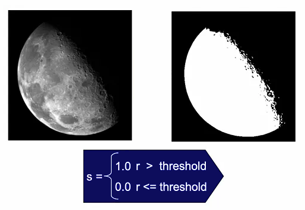</td>
    </tr>
</table>

Biến đổi ngưỡng hữu ích cho việc phân đoạn (**segmentation**), khi chúng ta muốn tách những vật thể ra khỏi background
- Đặt ngưỡng thấp -> hình ảnh thu được sẽ chứa nhiều giá trị cường độ cao. Và ngược lại

### Các kỹ thuật biến đổi tuyến tính từng phần
Ta có thể áp dụng những phép biến đổi khác nhau cho mỗi ngưỡng, để thu được ảnh kết quả theo ý muốn  

<table>
    <tr>
        <td>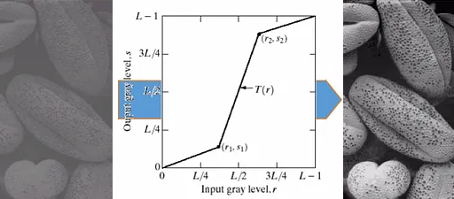</td>
    </tr>
    <tr>
        <td>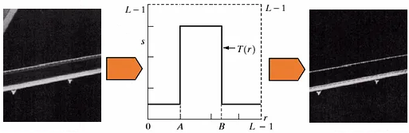</td>
    </tr>
</table>

#### Cắt mặt phẳng bit (bit plane slicing)
Bằng cách tách biệt các bit cụ thể của giá trị pixel trong hình ảnh, chúng ta có thể làm nổi bật các khía cạnh nhất định của hình ảnh đó.

<table>
    <tr>
        <td>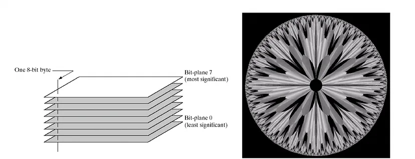</td>
    </tr>
    <tr>
        <td>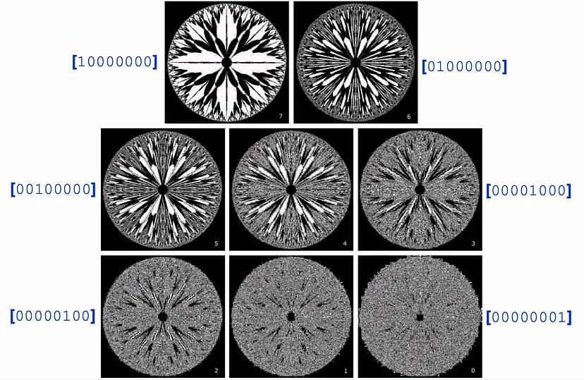</td>
    </tr>
</table>

(<a href="#readme-top">back to top</a>)

## Phần 3: Miền tần số
(**frequency domain**)

### Histogram 

Biểu đồ histogram của hình ảnh cho chúng ta biết sự phân bố các mức độ xám trong hình ảnh. Hữu ích trong xử lý hình ảnh, đặc biệt là trong phân đoạn (**segmentation**) và cải thiện ảnh (**enhancement**).

<table>
    <tr>
        <td>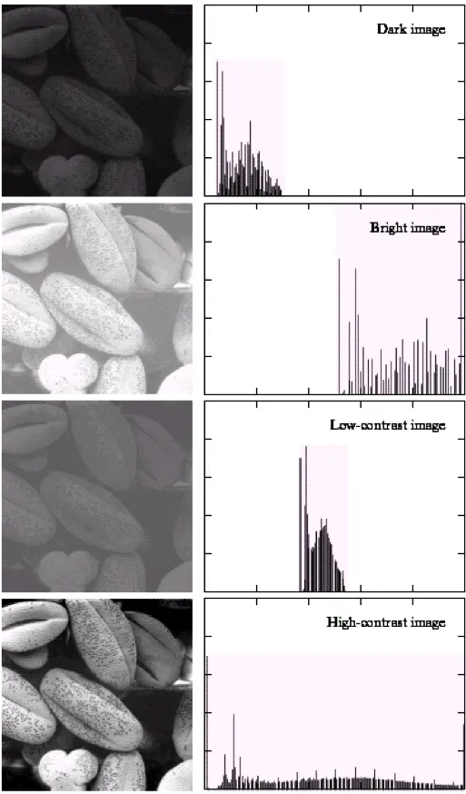</td>
    </tr>
    <tr>
        <th>Hình ảnh và biểu đồ histogram của chúng</th>
    </tr>
</table>

(<a href="#readme-top">back to top</a>)

# Chương 4: Lọc trong miền tần số

# Tài liệu tham khảo
- [What is Digital Image Processing? | Image Processing #1](https://medium.com/@gokcenazakyol/1-what-is-digital-image-processing-image-processing-2da13b5dfa9c) - Medium
- [What is Image Enhancement? | Image Processing #3](https://medium.com/@gokcenazakyol/what-is-image-enhancement-image-processing-3-32a813087e0a) - Medium